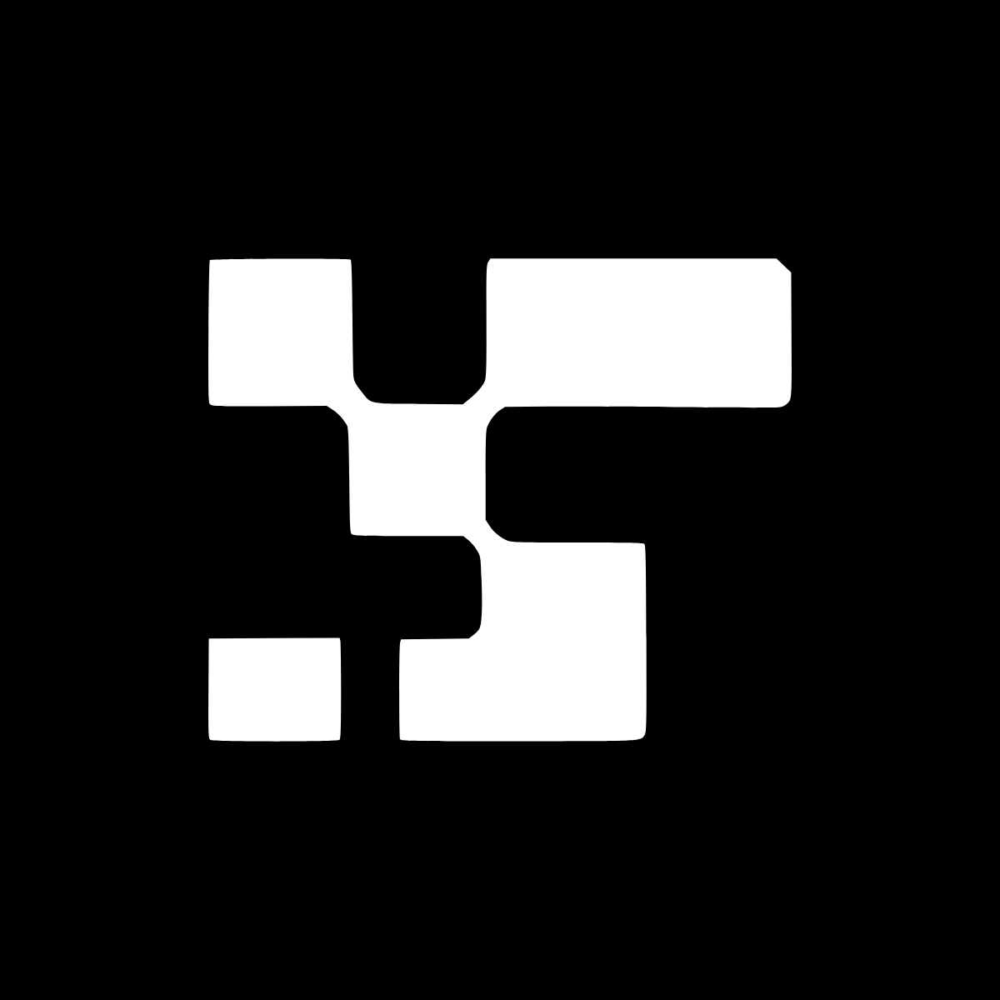

<p align="center">
  <a href="https://github.com/moumen-soliman/uitripled">
    
  </a>
</p>

<h1 align="center">UI TripleD</h1>

<p align="center">
  <strong>生产就绪的 UI 区块、组件和完整页面，提供 shadcn/ui 和 Base UI 两种版本，由 Framer Motion 驱动，内置 Landing Builder、Background Builder 和 Grid Generator。</strong>
</p>

<p align="center">

<br />
<a align="center" href="https://vercel.com/oss">
  
</a>
<br />
<br />
  <a href="https://ui.tripled.work/components">文档</a> ·
  <a href="https://github.com/moumen-soliman/uitripled/issues/new?template=bug_report.md">报告 Bug</a> ·
  <a href="https://github.com/moumen-soliman/uitripled/issues/new?template=feature_request.md">功能建议</a> ·
</p>

<p align="center">
  <a href="LICENSE.md"></a>
  <a href="https://github.com/moumen-soliman/uitripled/issues"></a>
</p>


## 特性

- **生产就绪的组件** - 精心打造的 UI 组件，基于 shadcn/ui 和 Framer Motion 构建
- **Landing Builder（页面构建器）** - 拖放 shadcn/ui 区块，秒级组装完整落地页
- **Background Builder（背景构建器）** - 着色器驱动的动画极光背景，快速调整并导出
- **Grid Generator（网格生成器）** - 只需几次点击即可组合复杂的 Tailwind CSS 网格布局
- **TypeScript 支持** - 全面的类型安全保障

## Turbo Monorepo

- 使用 Turborepo 和 pnpm workspaces 管理
- 通过 `turbo run <script>` 运行任务（例如 `pnpm dev --filter=uitripled-docs` 启动文档应用）
- 需要 Node.js 18+

## 技术栈

- [Turborepo](https://turbo.build/repo) + pnpm Workspaces
- [Next.js](https://nextjs.org) 16
- [React](https://react.dev) 19
- [TypeScript](https://www.typescriptlang.org)
- [Tailwind CSS](https://tailwindcss.com)
- [Framer Motion](https://www.framer.com/motion)
- [shadcn/ui](https://ui.shadcn.com)
- [Base UI](https://base-ui.com)
- [Radix UI](https://www.radix-ui.com)

## 赞助商

<table align="center">
  <tr>
    <td align="center">
      <a href="https://vercel.com">
        
      </a>
      <br />
      <strong><a href="https://vercel.com">Vercel</a></strong>
    </td>
    <td align="center">
      <a href="https://shadcnstudio.com">
        
      </a>
      <br />
      <strong><a href="https://shadcnstudio.com">shadcn/studio</a></strong>
    </td>
    <td align="center">
      <a href="https://shadcncraft.com">
        
      </a>
      <br />
      <strong><a href="https://shadcncraft.com">Shadcncraft</a></strong>
    </td>
  </tr>
  <tr>
    <td align="center">
      <a href="https://shadcnblocks.com">
        
      </a>
      <br />
      <strong><a href="https://shadcnblocks.com">Shadcnblocks.com</a></strong>
    </td>
    <td align="center">
      <a href="https://openpanel.dev">
        
      </a>
      <br />
      <strong><a href="https://openpanel.dev">OpenPanel</a></strong>
    </td>
    <td align="center">
      <a href="https://lucide-animated.com">
        
      </a>
      <br />
      <strong><a href="https://lucide-animated.com">lucide-animated</a></strong>
    </td>
  </tr>
  <tr>
    <td align="center">
      <a href="https://reactbits.dev">
        
      </a>
      <br />
      <strong><a href="https://reactbits.dev">ReactBits</a></strong>
    </td>
    <td align="center">
      <a href="https://shadcnspace.com">
        
      </a>
      <br />
      <strong><a href="https://shadcnspace.com">shadcnspace</a></strong>
    </td>
    <td align="center">
      <a href="https://efferd.com">
        
      </a>
      <br />
      <strong><a href="https://efferd.com">Efferd</a></strong>
    </td>
  </tr>
  <tr>
    <td align="center">
      <a href="https://shoogle.dev">
        
      </a>
      <br />
      <strong><a href="https://shoogle.dev">Shoogle</a></strong>
    </td>
  </tr>
</table>


## 快速开始

安装依赖：

```bash
pnpm install
```

启动开发服务器：

```bash
pnpm dev --filter=uitripled-docs
```

在浏览器中打开 [http://localhost:3000](http://localhost:3000)。

## 使用方法

浏览组件库中的组件，预览后将代码直接复制到你的项目中。使用可视化构建器自定义组件并实时预览。试试这些专业构建器：

- `Landing Builder` - 用于构建 shadcn/ui 落地页
- `Background Builder` - 用于着色器和动画极光背景
- `Grid Generator` - 用于 Tailwind CSS 网格布局

## 参与贡献

欢迎贡献！提交 Pull Request 前请阅读我们的[贡献指南](./CONTRIBUTING.md)。

## 许可证

详见 [LICENSE](./LICENSE.md)。

